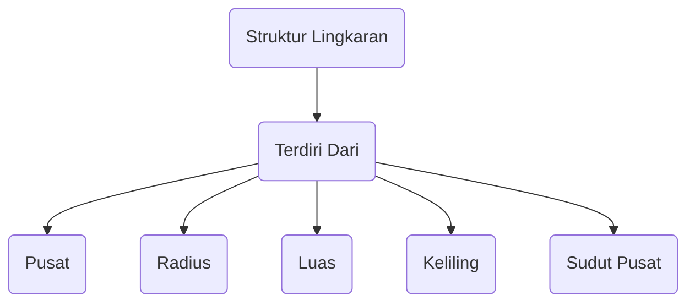
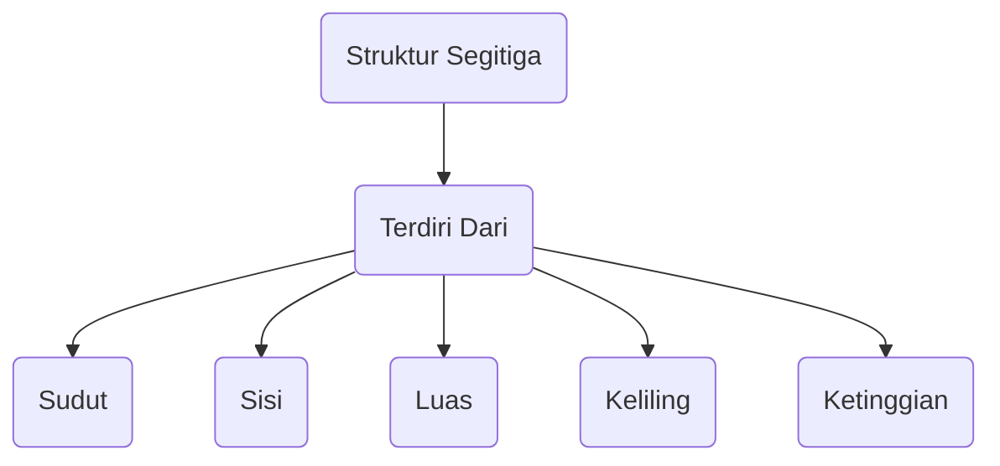
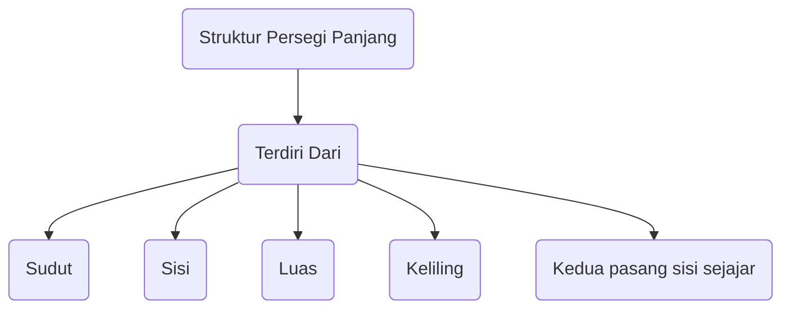
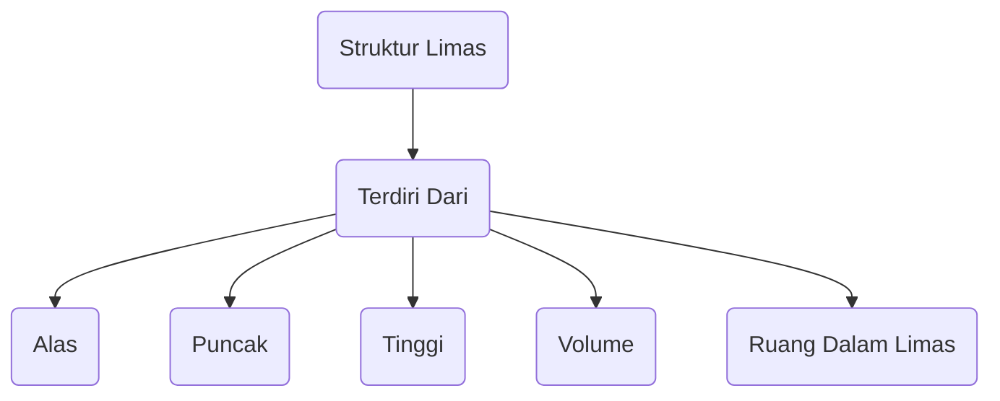
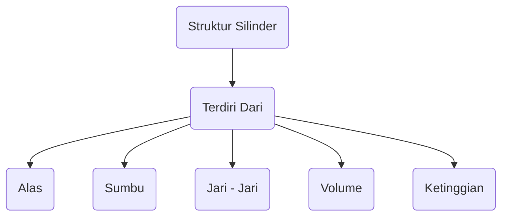
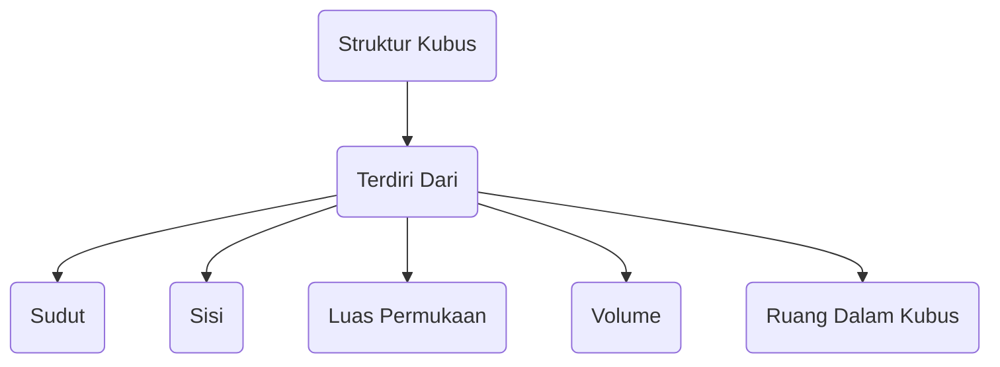



# GEOMETRI

## Pengenalan Geometri
Geometri adalah cabang matematika yang mempelajari sifat, ukuran, dan hubungan geometris antara objek-objek dalam ruang. 
Geometri membahas bentuk, ukuran, properti sudut, jarak, dan hubungan antara objek geometris seperti titik, garis, bidang, dan benda-benda tiga dimensi seperti kubus, bola, dan prisma.

### Contoh Bentuk Geometri

+ **Lingkaran**: Lingkaran adalah bentuk geometri yang terdiri dari semua titik yang berjarak sama dari pusatnya. Garis yang mengelilingi lingkaran disebut sebagai keliling atau sirkumferensi, dan jarak dari pusat ke tepi lingkaran disebut sebagai jari-jari.

	
	
	- Contoh : Roda mobil, mata koin, atau piring adalah contoh benda-benda yang memiliki bentuk lingkaran
		
		
		

+ **Segitiga**: Segitiga adalah bentuk geometri yang memiliki tiga sisi dan tiga sudut. Sudut-sudut ini bisa berbeda ukuran dan bentuk tergantung pada jenis segitiga (segitiga sama sisi, segitiga sama kaki, segitiga tumpul, segitiga lancip, dll.).

	
	
	- Contoh : Sebuah segitiga siku-siku adalah contoh segitiga dengan sudut tumpul, seperti segitiga pada sudut 3-4-5
	
		
		
	
+ **Persegi Panjang**: Persegi panjang adalah bentuk dengan empat sudut siku-siku dan dua pasang sisi sejajar yang panjangnya berbeda.

	
	
	- Contoh :  Sebuah buku adalah contoh dari persegi panjang. Dimensi panjang dan lebar pada buku yang berbeda menghasilkan bentuk persegi panjang
		
		
		

+ **Limas**:  Limas adalah benda tiga dimensi yang memiliki alas dengan bentuk dan ukuran tertentu dan memiliki sisi-sisi yang bertemu di satu titik puncak

	
	
	- Contoh : Piramida segi empat adalah contoh limas, di mana alasnya adalah segi empat dan semua sisi-sisinya berkumpul di satu puncak
	
		
		
	
+ **Silinder**: Silinder adalah benda tiga dimensi yang memiliki dua alas yang sama dan berbentuk lingkaran, dan sisi-sisinya berbentuk tabung

	
	
	- Contoh :  Botol air minum atau kaleng minuman adalah contoh dari silinder, di mana bagian atas dan bawahnya adalah lingkaran dan sisinya berbentuk tabung
		
		
		

+ **Kubus**:  Kubus adalah benda tiga dimensi yang memiliki enam wajah persegi dengan semua sudutnya siku-siku

	
	
	- Contoh : Kotak kertas tisu atau dadu permainan adalah contoh kubus
	
		
	
	
### Mermaid

+ Lingkaran

+ Segitiga

+ Persegi Panjang

+ Limas

+ Silinder

+ Kubus
